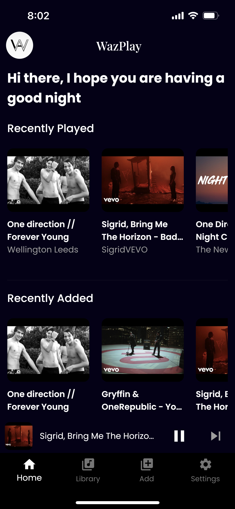
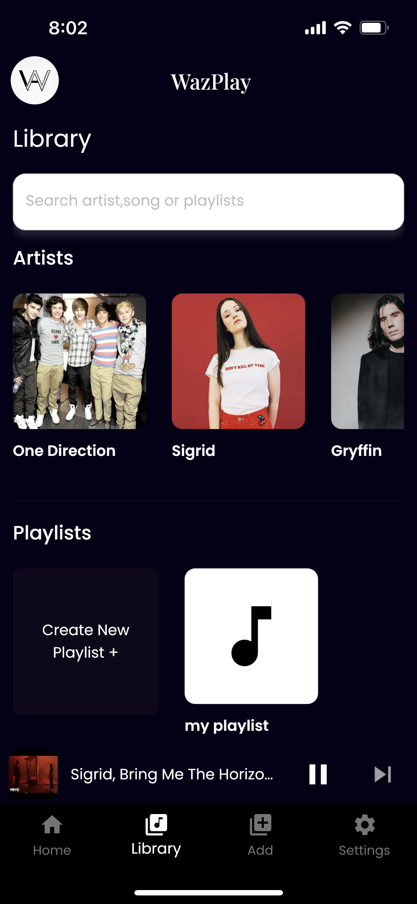
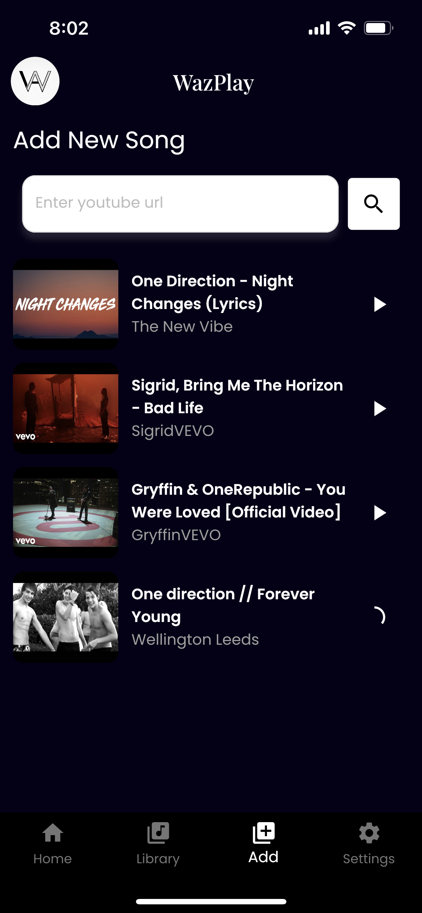
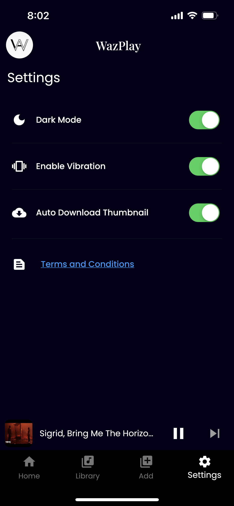
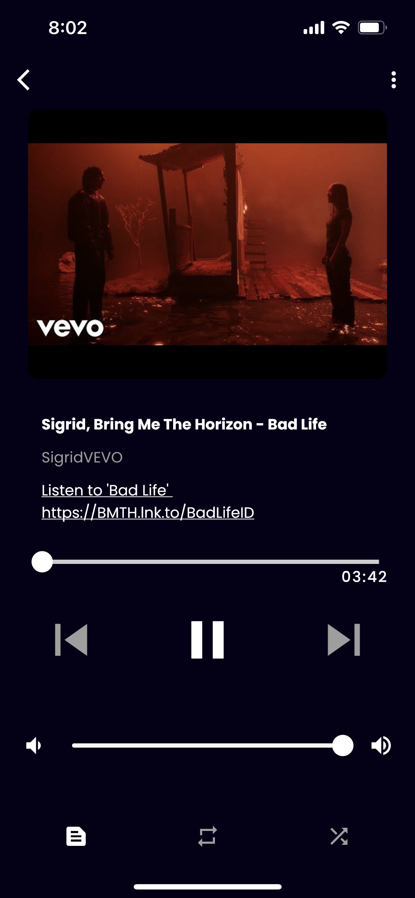
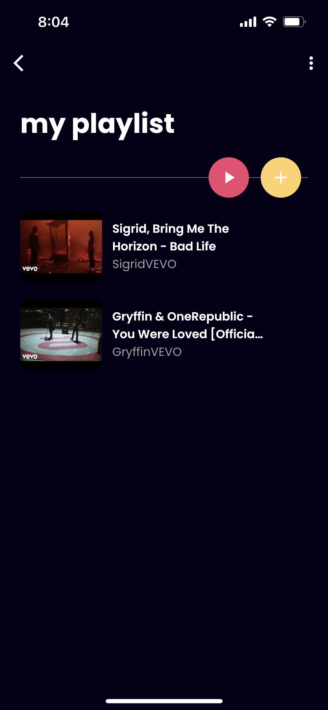

# wazplay

## Introduction

WazPlay is just a music app written in flutter and service to download song and play it.

WazPlay is the first product for **Waz** and so I decided to make it open-source. Watch and learn at your own risk. I really hope that you learn a lot from this app and make awesome apps by inspiring this. 👀✌️

> Please do not sell or sub-licensing the app for any reason.

## Features

- free
- download songs
- play them
- can make playlists
- supports background audio service
- can listen offline
- offers lyrics
- dark/light mode

## Previews

  
    
    
   
     
       

**I haven't reformat the code yet. So you can do it yourself.**

If you thanks me, I am just grateful that I help you in some ways.

If you are interested in making flutter mobile apps or Laravel web apps, please contact [this email](hello.waz99@gmail.com).

Check out other packages offered by **Waz**

- [WazEloquent](https://github.com/w99910/wazeloquent)

## CHEERS 🤘🤘
